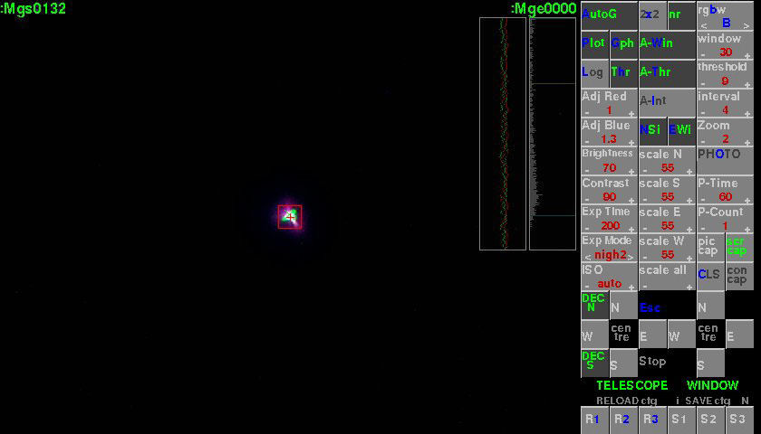
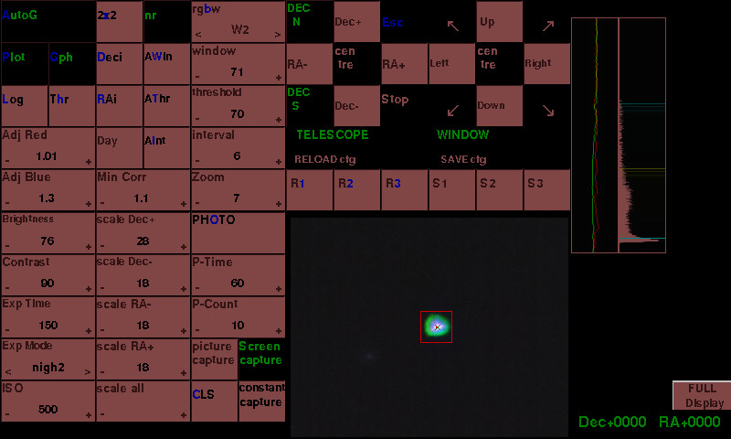

# Pi-AutoGuider
AutoGuider for a telescope using a Raspberry Pi, with RPi camera (v1 or v2) or suitable webcam.

This script was developed to auto guide a telescope through a ST-4 port using a Raspberry Pi (Pi2B/Pi3B/Pi3B+/Pi4 recommended) 
and a suitable interface.

The interface can be an opto-isolator, relay card available for the Pi, eg Seeed Raspberry PI card, 
PiFace Relay Plus card, Sainsmart USB 4 relay card or any 4 relay card you interface.

The relay cards can also be modified, different wiring to scope, to auto-guide other scopes eg Meade LX-10.

It can also be interfaced to scopes via an Arduino Uno, via USB. 
The Arduino Uno can also be controlled by a PC using software such as PHD. Details can be found under the [Arduino-Uno-AutoGuider](https://github.com/Gordon999/Arduino-Uno-AutoGuider) repository.

The Pi can also control a Canon DSLR, via an interface, to allow long exposure photographs.

Sony A6000 can also be controlled, extra FOCUS control gpio added (pin 23). See Sony.txt and photos for modifying 
Sony RM-SPR1 remote button, and interface.

Please take care when interfacing your telescope or camera. At your own risk.

## Screenshot, using 'Day' colours and 'normal' layout

## Screenshot, using 'Night' colours and 'Pi Display' layout

