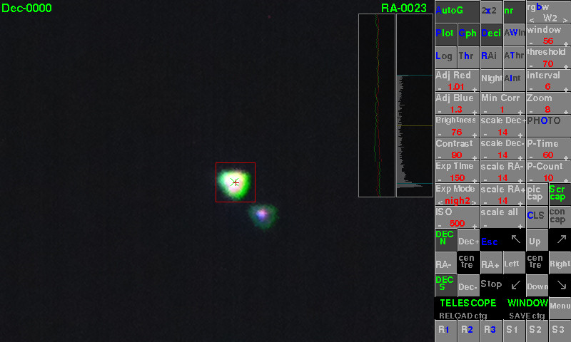

# Pi-AutoGuider
AutoGuider for a telescope using a Raspberry Pi

This script was developed to auto guide a telescope through a ST-4 port using a Raspberry Pi (Pi2B recommended) 
and a suitable interface.

The interface can be an opto-isolator, relay card available for the Pi, eg Seeed Raspberry PI card, 
PiFace Relay Plus card or any 4 relay card you interface.

The relay cards can also be modified, different wiring to scope, to auto-guide other scopes eg Meade LX-10.

It can also be interfaced to scopes via an Arduino Uno, via USB. 
The Arduino Uno can also be controlled by a PC using software such as PHD. Details under 'Arduino-Uno-AutoGuider' on github

The Pi can also control a Canon DSLR, via an interface, to allow long exposure photographs.

Please take care when interfacing your telescope. At your own risk.

## Screenshot

